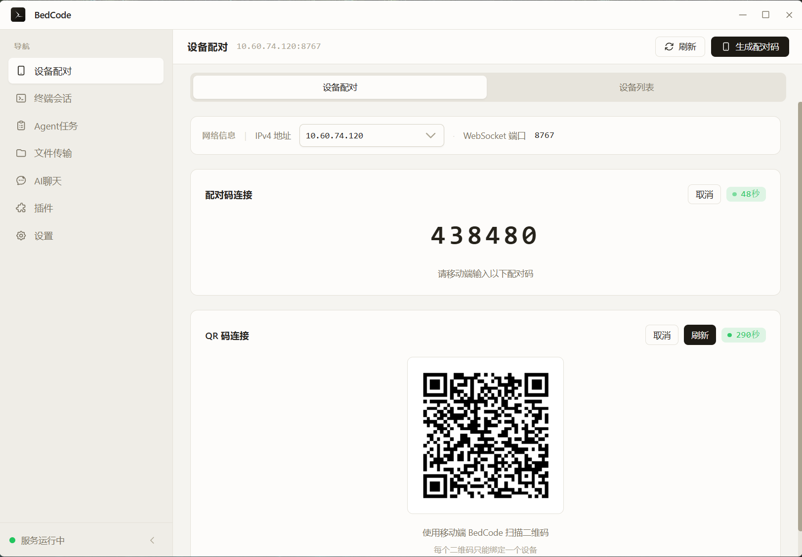
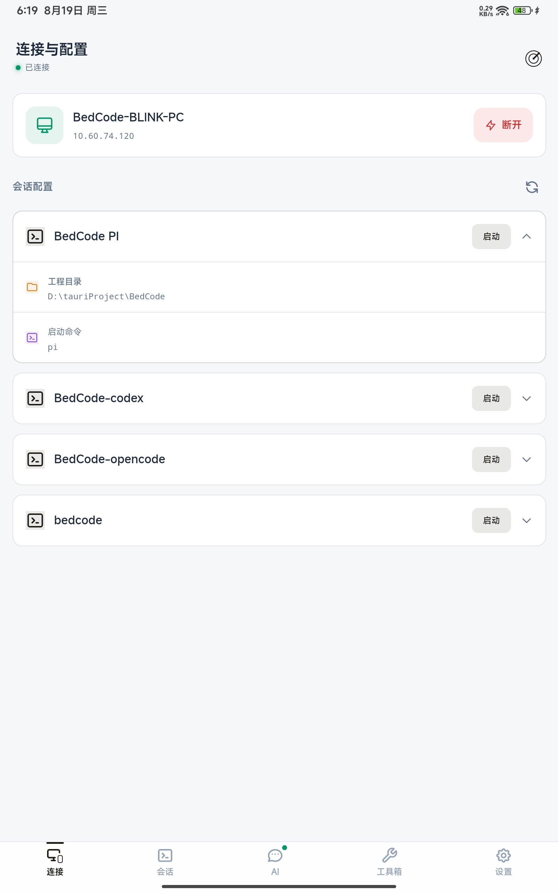
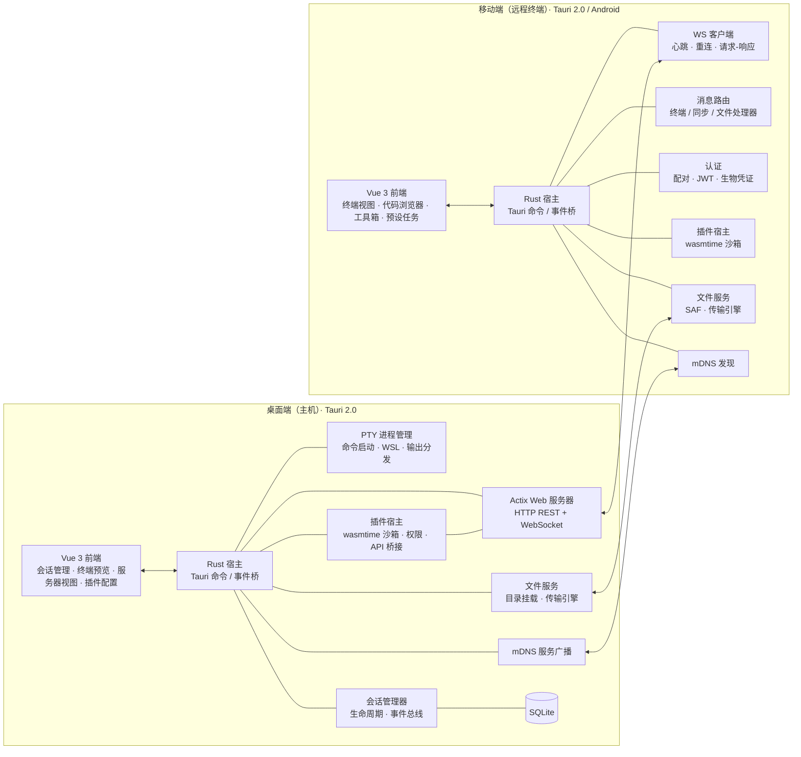

<div align="center">


# BedCode

[](https://github.com/7ZAI/BedCode)
[](LICENSE)
[](https://v2.tauri.app/)
[](https://github.com/7ZAI/BedCode)

[English](README_en.md) | 简体中文

</div>

BedCode 是一个局域网远程终端应用：桌面端作为主机运行终端会话（Claude Code、opencode 等 Agent CLI），手机变成带优化触控界面的远程终端，在同一 WiFi 下随时接管你的终端。任意命令行程序（含 TUI 应用）都可以在桌面端启动、从手机远程操作。

> 使用场景：如应用名所述，躺床上编程；或在家务、带孩子、睡觉的同时处理或监控开发编程任务。

## 界面

  桌面端



  移动端(平板)

  

## 功能特性

### 设备连接

 移动端连接桌面端

- **手动输入** — 手动输入桌面端ip地址 端口 + 6 位验证码安全配对 
- **mDNS** — 移动端通过mDNS扫描自动获取桌面端ip与端口 点击 输入配对码
- **二维码** — 移动端通扫描桌面端生成的二维码完成 
- **生物特征认证** — 在首次完成连接认证的前提下绑定指纹或者人脸识别，在下一次连接时可通过校验指纹免输入连接
- **连接历史** — 首次连接认证成功后移动端会记录连接历史认证凭证（7天有效期）通过点击连接历史即可连接


### 终端会话管理

- **终端配置** — 给终端配置启动命令、运行环境（支持WSL2）、工作目录的配置项 
- **终端输出** — 双端均采用xterm.js 模拟终端，以获取原生终端的输出显示体验；提供字体、显示主题配置
- **终端输入** — 桌面端与系统原生终端输入体验一致；移动端提供了快捷键配置（Tab、Ctrl+C、Esc、方向键）、常用命令配置、agent cli常用命令、快捷键预配置等一些列优化移动端终端输入体验的功能
- **代码浏览器** — 移动端的终端中提供项目文件浏览侧边栏、源码文件语法高亮、Git diff 渲染、分支切换等配合代码开发的功能


### 插件系统


- **插件管理** — 双端插件均可热插拔，即启即用、即停即止；设置插件自定义的配置项
- **现有插件** — 双端都有的插件其中AI Cahtbox 互相独立插件，其他两个为关联插件

<table>
<thead>
<tr><th align="left">插件</th><th align="left">版本</th><th align="left">说明</th></tr>
</thead>
<tbody>
<tr>
<td style="white-space:nowrap"><strong>AI Chatbox</strong></td>
<td style="white-space:nowrap">1.0.0-beta</td>
<td>AI 大模型对话：接入任意 OpenAI 兼容供应商（OpenAI / Anthropic / DeepSeek / 通义千问），流式对话、多会话管理、JSONL 对话日志落盘</td>
</tr>
<tr>
<td style="white-space:nowrap"><strong>Auto Task</strong></td>
<td style="white-space:nowrap">1.0.0-beta</td>
<td>Agent 任务队列与自动化执行：适配 Claude Code / pi / opencode / Codex；提供任务状态、任务队列调度、预设任务、定时任务与历史统计；agent 请求授权时自动放行等功能</td>
</tr>
<tr>
<td style="white-space:nowrap"><strong>File Transfer</strong></td>
<td style="white-space:nowrap">1.0.0-beta</td>
<td>内网文件传输：在线对端发现与切换、远程目录浏览、多任务并发传输（暂停 / 恢复 / 断点续传 / 失败重试），支持本地目录挂载供对端访问</td>
</tr>
</tbody>
</table>


### 国际化

vue-i18n 完整支持（zh-CN / en），设置页语言切换并持久化；错误码映射系统提供本地化错误消息。

## 架构

Monorepo 双独立项目，各自包含 `src/`（前端）+ `src-tauri/`（Rust 后端）：



<table>
<thead>
<tr><th align="left">端</th><th align="left">前端 (Vue 3)</th><th align="left">后端 (Rust)</th></tr>
</thead>
<tbody>
<tr>
<td style="white-space:nowrap"><strong>桌面端</strong></td>
<td>会话管理器、终端预览、服务器视图、插件配置</td>
<td>PTY、Actix Web（HTTP + WS）、会话管理、WASM 插件系统、mDNS 广播</td>
</tr>
<tr>
<td style="white-space:nowrap"><strong>移动端</strong></td>
<td>终端视图、代码浏览器、预设任务、工具箱、设备发现</td>
<td>WS/HTTP 客户端、远程连接与路由、文件服务、mDNS 发现</td>
</tr>
</tbody>
</table>

通信：**WebSocket**（终端双向流）+ **HTTP REST API**（插件 hooks、文件服务）。

## 技术栈

<table>
<thead>
<tr><th align="left">分类</th><th align="left">技术</th></tr>
</thead>
<tbody>
<tr><td style="white-space:nowrap">框架</td><td>Tauri 2.0（桌面端 Windows / 移动端 Android）</td></tr>
<tr><td style="white-space:nowrap">前端</td><td>Vue 3 + TypeScript + Vite</td></tr>
<tr><td style="white-space:nowrap">样式</td><td>TailwindCSS，状态管理 Pinia + vue-router</td></tr>
<tr><td style="white-space:nowrap">后端</td><td>Rust（Tokio 异步运行时），Actix Web 4 + tokio-tungstenite</td></tr>
<tr><td style="white-space:nowrap">数据库</td><td>SQLite（rusqlite）</td></tr>
<tr><td style="white-space:nowrap">终端</td><td>@xterm/xterm + addon-fit / web-links / webgl</td></tr>
<tr><td style="white-space:nowrap">认证</td><td>JWT（jsonwebtoken HS256）、ECDSA 生物凭证（p256）、设备指纹</td></tr>
<tr><td style="white-space:nowrap">加密</td><td>X25519 ECDH + AES-256-GCM（HKDF 派生）、ChaCha20-Poly1305、RSA-OAEP/PSS</td></tr>
<tr><td style="white-space:nowrap">设备发现</td><td>mDNS（mdns-sd）</td></tr>
<tr><td style="white-space:nowrap">插件系统</td><td>wasmtime（WASM 组件运行时）</td></tr>
<tr><td style="white-space:nowrap">其他</td><td>shiki（代码高亮）、ECharts（指标仪表盘）、qrcode / html5-qrcode、vue-i18n@9、tracing 日志</td></tr>
</tbody>
</table>


## 快速开始

### 安装

    在github release 获取最新版本安装包；安装

#### 支持平台

<table>
<thead>
<tr><th align="left">平台</th><th align="center">桌面端</th><th align="center">移动端</th></tr>
</thead>
<tbody>
<tr><td style="white-space:nowrap">Windows</td><td align="center">✔</td><td align="center">—</td></tr>
<tr><td style="white-space:nowrap">Android</td><td align="center">—</td><td align="center">✔</td></tr>
<tr><td style="white-space:nowrap">macOS / Linux</td><td align="center">预留</td><td align="center">—</td></tr>
<tr><td style="white-space:nowrap">iOS</td><td align="center">—</td><td align="center">预留</td></tr>
</tbody>
</table>

当前聚焦 **Windows（桌面端）+ Android（移动端）** 双平台，两端核心能力（终端会话、文件服务、插件系统）均已跑通。跨平台适配调试测试工作量较大（系统权限模型、打包分发、平台集成），精力有限暂未覆盖，有志同道合或者需求者可下载源码自行适配。

> 依托 Tauri 2.0 架构（Rust 后端 + Web 前端），跨平台的可能性与便利性天然保留：核心业务逻辑与 UI 均为跨平台技术，未来扩展 macOS / Linux / iOS 时无需重写业务代码，主要工作是平台适配层（打包、权限、系统 API 对接）。
### 环境要求

- [Node.js](https://nodejs.org/) >= 18、[Rust](https://www.rust-lang.org/tools/install) >= 1.94（wasmtime 47 MSRV）
- [Tauri 2.0 CLI](https://v2.tauri.app/start/prerequisites/) 及平台相关依赖
- 已安装并配置 Agent CLI（如 [Claude Code](https://claude.ai/code)）

### 安装与运行

```bash
# 安装依赖
cd bedcode-desktop && npm install
cd bedcode-mobile && npm install

# 开发
cd bedcode-desktop && npm run tauri:dev         # 桌面端
cd bedcode-mobile && npm run tauri:android:dev  # 移动端（查看 Android 日志：tauri:android:dev:log）

# 构建
cd bedcode-desktop && npm run tauri:build
cd bedcode-mobile && npm run tauri:android:build

# 测试
cd bedcode-desktop && npm run test:run          # 前端（vitest run）
cd bedcode-desktop/src-tauri && cargo test      # Rust
```

## 插件系统

桌面端插件基于 **wasmtime 运行时（WASM Component Model）**：插件由 Rust / TypeScript 编译为 WASM 组件，在宿主内沙箱加载运行。插件可观察和扩展宿主会话行为：

- **WASM 沙箱运行时** — 资源受限、内存隔离，插件崩溃不影响宿主

- **动态加载** — 扫描 `plugins/desktop/{plugin-id}/plugin.json` 运行时加载，无需重编译宿主

- **宿主 API 桥接** — 使用wit、wit-bindgen自动根据trait 生成胶水层ABI桥接

  


### 插件开发 SDK

- **`@binblink/plugin-sdk-desktop`** / **`@binblink/plugin-sdk-mobile`**（npm，MIT）— 主 API、Vite 插件（`./vite`）、共享 UI 组件（`./ui`）、类型定义（`./types`）等子路径导出
- **脚手架 CLI** — `bedcode-plugin-desktop`（移动端 `bedcode-plugin`）：`create` 生成插件工程、`dev` 浏览器 HMR 开发环境、`build` 构建、`manifest` 自动填充声明、`validate` 校验、`doctor` 环境自检
- **开发文档** — `bedcode-desktop/plugin-dev-desktop.md`（桌面端）与 `bedcode-mobile/plugin-dev-mobile.md`（移动端）
- **浏览器开发环境（dev-shell）** — 两 SDK 均内置 `dev-shell`：空壳宿主 + 双端页面骨架，在浏览器中直接运行插件前端源码（支持 HMR），无需构建、打包、真机安装即可迭代 UI 与前端逻辑。
  - 启动：`bedcode-plugin-desktop dev`（移动端 `npm run dev` / `npx bedcode-plugin dev`）；`--host` 监听局域网后可手机浏览器访问预览（真实触控 / 真机视口）
  - 骨架能力：标题栏 / 侧边栏 / 工具箱 / 模拟终端（输入发送 + 模拟输出 + 会话管理）/ 插件页（注册项一览 + 激活停用）/ 状态栏 / 日志面板 / 深浅色主题切换
  - Mock 边界：`commands.execute` 仅执行前端 handler（Rust WASM 后端命令不可用）、`http.registerEndpoint` 仅登记展示、`storage` 走 localStorage、`fileService` 为内存注册表；权限检查跳过（视为全部授予）——Rust 命令、真实 HTTP 端点、系统文件选择等真机专属能力需在真实宿主验证

### 开发计划

**正在开发（未发布）**

- **PTY 输出管线重构** — 终端输出链路全面升级：新二进制流式帧协议（TB v2，16B 帧头 + 序列号，支持缺口检测与重播去重）、每会话独立终端 WebSocket 路由（`/ws/terminal/session/{id}`）、移动端直连终端 WS（authentication 首消息 + 状态机缓冲 + 重连退避）、输出队列 seq 化快照订阅（订阅 → 快照 → HistoryEnd → 实时增量）、旧广播兼容通道拆除。桌面端服务端与移动端客户端均已完成，待联调验证后随下一版本发布
- **AI Chatbox WASI 预打开文件访问** — 插件构建目标切换 `wasm32-wasip2`（产物直接为 WASI 组件），宿主接入 wasmtime-wasi：激活时按插件配置 preopen 目录，插件经 WASI preview2 `std::fs` 直读写文件，不再完全依赖宿主 host_fs 代理；配套三端配置契约（`useSelfFileAccess` / `fileAccessDir` / `defaultDir`，plugin.json + 前端 + Rust 对齐），preopen 前复用 `fs_auth.is_granted()` 无弹窗授权校验，未授权自动回退 host_fs

**规划中**

- **加密接口实现** — 宿主已具备完整加密工具链：对称 AEAD（AES-256-GCM / ChaCha20-Poly1305）+ HKDF 会话密钥派生、X25519 ECDH 密钥协商、RSA-OAEP/PSS、混合加密（非对称封装会话密钥 + 对称加密载荷），当前用于 HTTP 报文加密与文件加密传输。规划将其开放为插件 SDK 加密接口（插件可加解密 / 签名验签 / 密钥协商），并为终端与文件传输链路提供端到端加密选项
- **内网穿透扩展支持** — 桌面端以插件形式实现内网穿透（需求已确认，待排期，见 `.scratch/remote-tunnel/` 与 `docs/adr/0017`）：经用户自购云服务器（中继，LE 证书 TLS 终止）让外网移动端像在内网一样使用（终端 WS + 文件服务 HTTP + 插件 HTTP 端点全穿透，协议无关透明管道）；含安全加固：JWT 密钥随机化、双层限速、128-bit 隧道 ID 即凭据、首次配对仅限局域网、暴露控制 kill switch + 默认 8h 自动关闭 + 并发设备上限。采用可信中继 TLS 模型，不做端到端加密

**架构演进**

- **WASI 标准化红利** — 插件运行于 WASM Component Model + wasmtime 沙箱之上，已接入 WASI preview2（文件系统 / 预打开目录）。随 WASI 标准完善（网络、时钟、进程等系统接口标准化），插件将在安全沙箱内获得近原生系统能力，且保持跨宿主可移植
- **彻底插件化愿景** — 宿主保持最小核心（窗口、通信、认证、插件加载），终端、文件服务、AI 工具等一切能力皆以插件形式热插拔；「host + plugin」架构让工具制作从少数开发者手中解放——任何人用自己的领域语言描述需求，云上 AI 生成插件、构建、托管，装进宿主即装即用，人人都能直接面对自己的需求

## 贡献指南

欢迎贡献！随时提交 Pull Request：

1. Fork 本仓库
2. 创建功能分支（`git checkout -b feat/my-feature`）
3. 提交更改（`git commit -m 'feat: ...'`）
4. 推送分支并发起 PR

## 许可证

MIT - 详见 [LICENSE](LICENSE)。
