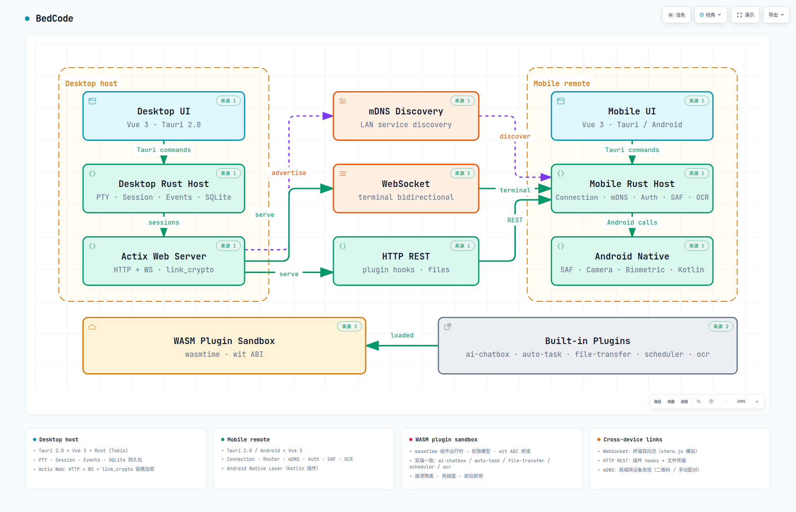

<div align="center">


# BedCode

**Control your desktop Agent CLI from your phone — from bed**

[](https://github.com/7ZAI/BedCode)
[](LICENSE)
[](https://v2.tauri.app/)
[](https://wasmtime.dev/)
[](https://github.com/7ZAI/BedCode)

English | [简体中文](README.md)

</div>

BedCode is a LAN remote terminal application: the desktop app acts as the host running terminal sessions (Agent CLI such as Pi, Opencode, etc.), while your phone becomes a remote terminal with an optimized touch interface — take over your terminal from anywhere on the same WiFi. Any command-line program (including TUI apps) can be started on the desktop and operated remotely from your phone.

The plugin system is another core capability: plugins run as WASM components inside the wasmtime sandbox (Component Model + wit ABI bridging), resource-limited and memory-isolated — a crash doesn't affect the host; both ends are hot-pluggable and ready out of the box. A full plugin development toolchain comes with it — TypeScript / Rust dual-side SDKs, a scaffolding CLI, and a browser dev-shell development environment; three built-in plugins (AI Chatbox for multi-vendor LLM chat, Auto Task for agent task queues, File Transfer for LAN file exchange) let host capabilities grow freely like browser extensions.

> Use cases: as the name suggests — coding from bed; or handling programming tasks in parallel with chores, childcare, or sleep at home.

## Features

### Device Connection

The mobile app connects to the desktop host:

- **Manual input** — enter the desktop's IP address, port and a 6-digit pairing code for secure pairing
- **mDNS** — auto-discover the desktop's IP and port via mDNS, then tap and enter the pairing code
- **QR code** — scan the QR code generated by the desktop to finish pairing
- **Biometric authentication** — after the first successful pairing, bind fingerprint or face recognition and verify with a fingerprint on subsequent connections to skip typing the code
- **Connection history** — after the first successful pairing, the mobile app stores the connection credential (7-day expiry) on the history list for one-tap reconnect

### Terminal Session Management

- **Terminal configuration** — configure the startup command, runtime environment (WSL2 supported) and working directory per terminal
- **Terminal output** — both ends use xterm.js for a native terminal output experience, with font and display theme configuration
- **Terminal input** — the desktop matches native terminal input; the mobile app adds shortcut configuration (Tab, Ctrl+C, Esc, arrows), common-command configuration, agent-CLI quick commands and preconfigured shortcuts to optimize mobile terminal input
- **Code explorer** — a project file browser sidebar inside the mobile terminal with syntax highlighting, Git diff rendering and branch switching

### Plugin System

- **Plugin management** — plugins on both ends are hot-pluggable: enable on demand, stop on demand; configure per-plugin settings
- **Built-in plugins** — both ends ship with the same plugin set; AI Chatbox is independent per end, the other two are companion plugins

<table>
<thead>
<tr><th align="left">Plugin</th><th align="left">Version</th><th align="left">Description</th></tr>
</thead>
<tbody>
<tr>
<td><strong>AI&nbsp;Chatbox</strong></td>
<td>1.0.0-beta</td>
<td>LLM chat: connect to any OpenAI-compatible provider (OpenAI / Anthropic / DeepSeek / Qwen), streaming chat, multi-conversation management, JSONL chat logs persisted to disk</td>
</tr>
<tr>
<td><strong>Auto&nbsp;Task</strong></td>
<td>1.0.0-beta</td>
<td>Agent task queue &amp; auto-approval: sync task status from Claude Code / pi / opencode / Codex, task queue scheduling, preset &amp; scheduled tasks, history statistics; auto-approves agent permission requests</td>
</tr>
<tr>
<td><strong>File&nbsp;Transfer</strong></td>
<td>1.0.0-beta</td>
<td>LAN file transfer: online peer discovery &amp; switching, remote directory browsing, concurrent transfers (pause / resume / resumable / retry), local directory mounting for peers</td>
</tr>
</tbody>
</table>

### Internationalization

Full vue-i18n support (zh-CN / en) with persistent language switcher in settings; error code mapping system for localized error messages.

## Architecture

Monorepo with two independent projects, each containing `src/` (frontend) + `src-tauri/` (Rust backend):

<a href="docs/architecture/BedCode.architecture.html" target="_blank">
  
</a>

<sub>📈 Interactive version: dark / light themes, node focus, route tracing, share-card export —— <a href="docs/architecture/BedCode.architecture.html" target="_blank">Open</a> · Source: <a href="docs/architecture/BedCode.architecture.json">archify JSON IR</a> (rendered by <a href="https://github.com/tt-a1i/archify">Archify</a>)</sub>

<table>
<thead>
<tr><th align="left">End</th><th align="left">Frontend (Vue 3)</th><th align="left">Backend (Rust)</th></tr>
</thead>
<tbody>
<tr>
<td><strong>Desktop</strong></td>
<td>Session manager, terminal preview, server view, plugin config</td>
<td>PTY, Actix Web (HTTP + WS), session management, WASM plugin system, mDNS advertisement</td>
</tr>
<tr>
<td><strong>Mobile</strong></td>
<td>Terminal view, code explorer, preset tasks, toolbox, device discovery</td>
<td>WS/HTTP client, remote connection &amp; routing, file service, mDNS discovery</td>
</tr>
</tbody>
</table>

Communication: **WebSocket** (bidirectional terminal stream) + **HTTP REST API** (plugin hooks, file service).

## Tech Stack

<table>
<thead>
<tr><th align="left">Category</th><th align="left">Technology</th></tr>
</thead>
<tbody>
<tr><td>Framework</td><td>Tauri 2.0 (Windows / Linux desktop / Android mobile)</td></tr>
<tr><td>Frontend</td><td>Vue 3 + TypeScript + Vite</td></tr>
<tr><td>Styling</td><td>TailwindCSS, state management with Pinia + vue-router</td></tr>
<tr><td>Backend</td><td>Rust (Tokio async runtime), Actix Web 4 + tokio-tungstenite</td></tr>
<tr><td>Database</td><td>SQLite (rusqlite)</td></tr>
<tr><td>Terminal</td><td>@xterm/xterm + addon-fit / web-links / webgl</td></tr>
<tr><td>Auth</td><td>JWT (jsonwebtoken HS256), ECDSA biometric credentials (p256), device fingerprint</td></tr>
<tr><td>Crypto</td><td>X25519 ECDH + AES-256-GCM (HKDF), ChaCha20-Poly1305, RSA-OAEP/PSS</td></tr>
<tr><td>Discovery</td><td>mDNS (mdns-sd)</td></tr>
<tr><td>Plugin System</td><td>wasmtime (WASM component runtime)</td></tr>
<tr><td>Other</td><td>shiki (syntax highlighting), ECharts (metrics dashboard), qrcode / html5-qrcode, vue-i18n@9, tracing logging</td></tr>
</tbody>
</table>

## Quick Start

### Install

Get the latest installer from the GitHub release page, then install it.

#### Supported Platforms

<table>
<thead>
<tr><th align="left">Platform</th><th align="center">Desktop</th><th align="center">Mobile</th></tr>
</thead>
<tbody>
<tr><td>Windows</td><td align="center">✔</td><td align="center">—</td></tr>
<tr><td>Linux</td><td align="center">✔</td><td align="center">—</td></tr>
<tr><td>Android</td><td align="center">—</td><td align="center">✔</td></tr>
<tr><td>macOS</td><td align="center">Planned</td><td align="center">—</td></tr>
<tr><td>iOS</td><td align="center">—</td><td align="center">Planned</td></tr>
</tbody>
</table>

Currently focused on **Windows / Linux (Desktop) + Android (Mobile)**, with both ends' core capabilities (terminal sessions, file service, plugin system) fully working. Remaining macOS / iOS adaptation involves differentiated work around system permission models, packaging & distribution, and platform integration — not yet covered due to limited bandwidth. If you are interested or in need, feel free to fork the source and adapt it yourself.

> Built on Tauri 2.0 (Rust backend + Web frontend), cross-platform possibility and convenience are naturally preserved: core business logic and UI are cross-platform technologies. Extending to macOS / iOS later requires no rewrite of business code — the main work is a platform adaptation layer (packaging, permissions, system API integration).

### Prerequisites

- [Node.js](https://nodejs.org/) ≥ 18, [Rust](https://www.rust-lang.org/tools/install) ≥ 1.94 (wasmtime 47 MSRV)
- [Tauri 2.0 CLI](https://v2.tauri.app/start/prerequisites/) and platform dependencies
- An Agent CLI installed and configured (e.g. [Claude Code](https://claude.ai/code))

### Install & Run

```bash
# Install dependencies
cd bedcode-desktop && pnpm install
cd bedcode-mobile && pnpm install

# Development
cd bedcode-desktop && pnpm run tauri:dev         # Desktop
cd bedcode-mobile && pnpm run tauri:android:dev  # Mobile (Android logs: tauri:android:dev:log)

# Build
cd bedcode-desktop && pnpm run tauri:build
cd bedcode-mobile && pnpm run tauri:android:build

# Testing
cd bedcode-desktop && pnpm run test:run          # Frontend (vitest run)
cd bedcode-desktop/src-tauri && cargo test      # Rust
```

## Plugin System

Desktop plugins are built on the **wasmtime runtime (WASM Component Model)**: plugins are compiled to WASM components (from Rust / TypeScript) and loaded sandboxed inside the host. Plugins can observe and extend host session behavior:

- **WASM Sandbox Runtime** — resource-constrained, memory-isolated; a plugin crash never affects the host
- **Dynamic Loading** — scanned from `plugins/desktop/{plugin-id}/plugin.json` at runtime, no host recompilation needed
- **Host API Bridge** — wit + wit-bindgen auto-generates the glue ABI bridge from the trait

### Plugin Development SDK

- **`@binblink/bedcode-plugin-sdk-desktop`** / **`@binblink/bedcode-plugin-sdk-mobile`** (npm, MIT) — subpath exports: main API, Vite plugin (`./vite`), shared UI components (`./ui`), type definitions (`./types`)
- **Scaffolding CLI** — `bedcode-plugin-desktop` (mobile: `bedcode-plugin`): `create` scaffolds a plugin project, `dev` browser HMR dev environment, `build`, `manifest` auto-fills declarations, `validate`, `doctor` environment self-check
- **Docs** — `bedcode-desktop/plugin-dev-desktop.md` (desktop) and `bedcode-mobile/plugin-dev-mobile.md` (mobile)
- **Browser dev environment (dev-shell)** — both SDKs ship a `dev-shell`: an empty-shell host + page skeleton that runs the plugin's frontend source directly in the browser (HMR), so UI and frontend logic can be iterated without building, packaging, or installing on a real device.
  - Start it with `bedcode-plugin-desktop dev` (mobile: `pnpm run dev` / `pnpm exec bedcode-plugin dev`); `--host` listens on the LAN so the page can be previewed in a phone browser (real touch, real viewport)
  - Skeleton features: title bar / sidebar / toolbox / mock terminal (send input + simulate output + session management) / plugin page (registered items overview + activate/deactivate) / status bar / log panel / dark-light theme switching
  - Mock boundaries: `commands.execute` runs frontend handlers only (Rust WASM backend commands unavailable), `http.registerEndpoint` is display-only, `storage` uses localStorage, `fileService` is an in-memory registry; permission checks are skipped (treated as fully granted) — device-only capabilities (Rust commands, real HTTP endpoints, system file pickers) must be verified in the real host

### Roadmap

**In development (unreleased)**

- **Desktop Code Viewer** — adds a left-side code viewer panel to the desktop terminal window (aligning with the mobile side's existing capability): project file tree browsing + multi-tab code view + shiki syntax highlighting (VS Code–sourced, dual-theme CSS variables) + auto-anchoring to the session's working_dir + large-file / binary / permission-error interception + dynamic terminal width allocation. Backend `commands/code_viewer.rs` exposes `list_code_dir` / `read_code_file` / `stat_code_file` with full-chain defense against path traversal, encoding detection, and permission errors (16 inline unit tests); frontend state layer `useCodeViewer` + highlighter `useCodeHighlighter` + panel components `CodeViewerPanel` / `FileTree` / `CodeTabs`, with zh/en i18n synchronized. Complete on the `feature/code-viewer` branch; shipping in the next release.
- **Disk Cleaner Plugin** — a desktop built-in WASI component targeting Windows `%USERPROFILE%\AppData\Local` and Linux `$XDG_CACHE_HOME` for personal cache and user-scope system residue, matching CCleaner-class cache cleaning. Zero WIT changes, zero ABI bumps: the plugin mounts the user cache root via manifest `wasiPreopenDirs: ["${cacheRoot}"]`, the host resolves the mount point per platform, and the plugin only sees a fixed mount point; deletion = move to quarantine + lazy expiry, never bypassing quarantine. Multi-round issue iteration complete (skeleton → rules → hard blacklist → quarantine → batch restore → lazy expiry → Linux platform adaptation → i18n dictionaries).

**Planned**

- **NAT traversal / internet access** — realized as a desktop-side plugin (requirements confirmed, pending scheduling; see `.scratch/remote-tunnel/` and `docs/adr/0017`): route through a user-owned cloud relay (TLS termination with LE certificates) so a remote mobile device works exactly like on-LAN (terminal WS + file-service HTTP + plugin HTTP endpoints all tunneled through a protocol-agnostic pipe), with security hardening: randomized JWT secret, two-tier rate limiting, high-entropy 128-bit tunnel IDs as credentials, first-pairing LAN-only, and a kill switch with 8h auto-close by default plus a concurrent-device cap. Trusted-relay TLS model, no end-to-end encryption (shelved until a server budget exists 😭)
- **AI Agent CLI UI management** — extends the currently terminal-session-only Agent CLIs (Claude Code / pi / opencode / Codex) into a graphical management panel on the desktop: Agent version detection and configuration (model provider, system prompt, permission presets, context strategy), task orchestration (presets / schedules / dependency graphs), concurrent queue with authorization delegation, JSONL log retrieval and replay, execution state visualization (tokens / cost / duration), and failure retry with manual intervention. Builds on the existing Auto Task plugin's session bridging; the UI layer sinks into the plugin sandbox, with the host only providing Agent CLI lifecycle hooks.

**Architecture evolution**

- **Wasmtime microkernel · plugin-driven evolution** — the host continues to converge toward a microkernel: the wasmtime sandbox + component loader + auth/communication form the irreducible core, and everything else (terminal, file service, AI Chatbox, Auto Task, File Transfer, Disk Cleaner) is a hot-pluggable WASM plugin. Plugins run on the WASM Component Model + wasmtime sandbox and now include WASI preview2 (filesystem / preopened directories). As WASI standardizes further (networking, clocks, processes, and other system interfaces), plugins gain near-native system capabilities inside a secure sandbox while staying portable across hosts, languages, and platforms — no host recompilation required to introduce a new capability.

## Does Plugin-Based + AI Deliver?

- **App plugin-ization + AI prospect** — the host stays a minimal core with all capabilities hot-pluggable as plugins; the SDK the "host + plugin" architecture provides encapsulates the engineering capabilities that ordinary users lack most (the SDK standardizes them) — establishing development boundaries for AI while expanding the app, bringing software development truly to the masses: anyone can describe their needs in natural language to build extension apps. Compute power + cloud AI Agent-generated plugins will exist as a service form, plugged into the host app and used instantly.

## Contributing

Contributions are welcome! Please feel free to submit a Pull Request.

1. Fork the repository
2. Create your feature branch (`git checkout -b feat/my-feature`)
3. Commit your changes (`git commit -m 'feat: ...'`)
4. Push to the branch and open a Pull Request

## License

MIT - see the [LICENSE](LICENSE) file for details.
