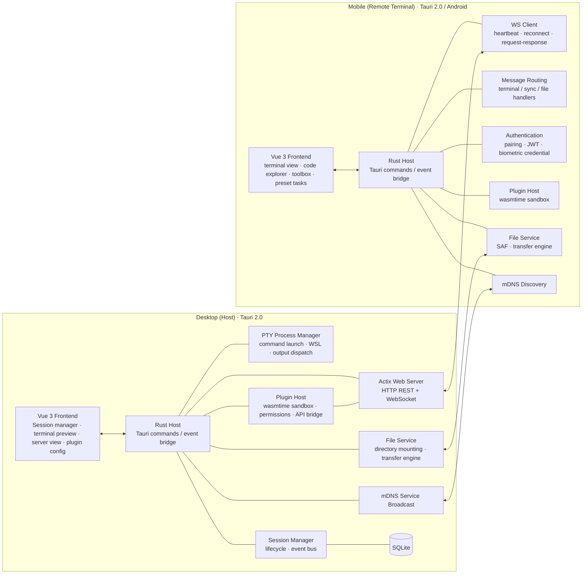

<div align="center">


# BedCode

**Control your desktop Agent CLI from your phone — from bed**

[](https://github.com/7ZAI/BedCode)
[](LICENSE)
[](https://v2.tauri.app/)
[](https://github.com/7ZAI/BedCode)

English | [简体中文](README.md)

</div>

BedCode is a LAN remote terminal application: the desktop app acts as the host running terminal sessions (Agent CLIs like Claude Code, opencode), while your phone becomes a remote terminal with an optimized touch interface — take over your terminal from anywhere on the same WiFi. Any command-line program (including TUI apps) can be started on the desktop and operated remotely from your phone.

> Use cases: as the name suggests — coding from bed; or handling programming tasks in parallel with chores, childcare, or sleep at home.

## Interface

  Desktop


  Mobile (tablet)

  

## Features

### Device Connection

The mobile app connects to the desktop host:

- **Manual input** — enter the desktop's IP address, port and a 6-digit pairing code for secure pairing
- **mDNS** — auto-discover the desktop's IP and port via mDNS, then tap and enter the pairing code
- **QR code** — scan the QR code generated by the desktop to finish pairing
- **Biometric authentication** — after the first successful pairing, bind fingerprint or face recognition and verify with a fingerprint on subsequent connections to skip typing the code
- **Connection history** — after the first successful pairing, the mobile app stores the connection credential (7-day expiry) on the history list for one-tap reconnect

### Terminal Session Management

- **Terminal configuration** — configure the startup command, runtime environment (WSL2 supported) and working directory per terminal
- **Terminal output** — both ends use xterm.js for a native terminal output experience, with font and display theme configuration
- **Terminal input** — the desktop matches native terminal input; the mobile app adds shortcut configuration (Tab, Ctrl+C, Esc, arrows), common-command configuration, agent-CLI quick commands and preconfigured shortcuts to optimize mobile terminal input
- **Code explorer** — a project file browser sidebar inside the mobile terminal with syntax highlighting, Git diff rendering and branch switching

### Plugin System

- **Plugin management** — plugins on both ends are hot-pluggable: enable on demand, stop on demand; configure per-plugin settings
- **Built-in plugins** — both ends ship with the same plugin set; AI Chatbox is independent per end, the other two are companion plugins

<table>
<thead>
<tr><th align="left">Plugin</th><th align="left">Version</th><th align="left">Description</th></tr>
</thead>
<tbody>
<tr>
<td style="white-space:nowrap"><strong>AI Chatbox</strong></td>
<td style="white-space:nowrap">1.0.0-beta</td>
<td>LLM chat: connect to any OpenAI-compatible provider (OpenAI / Anthropic / DeepSeek / Qwen), streaming chat, multi-conversation management, JSONL chat logs persisted to disk</td>
</tr>
<tr>
<td style="white-space:nowrap"><strong>Auto Task</strong></td>
<td style="white-space:nowrap">1.0.0-beta</td>
<td>Agent task queue &amp; auto-approval: sync task status from Claude Code / pi / opencode / Codex, task queue scheduling, preset &amp; scheduled tasks, history statistics; auto-approves agent permission requests</td>
</tr>
<tr>
<td style="white-space:nowrap"><strong>File Transfer</strong></td>
<td style="white-space:nowrap">1.0.0-beta</td>
<td>LAN file transfer: online peer discovery &amp; switching, remote directory browsing, concurrent transfers (pause / resume / resumable / retry), local directory mounting for peers</td>
</tr>
</tbody>
</table>

### Internationalization

Full vue-i18n support (zh-CN / en) with persistent language switcher in settings; error code mapping system for localized error messages.

## Architecture

Monorepo with two independent projects, each containing `src/` (frontend) + `src-tauri/` (Rust backend):



<table>
<thead>
<tr><th align="left">End</th><th align="left">Frontend (Vue 3)</th><th align="left">Backend (Rust)</th></tr>
</thead>
<tbody>
<tr>
<td style="white-space:nowrap"><strong>Desktop</strong></td>
<td>Session manager, terminal preview, server view, plugin config</td>
<td>PTY, Actix Web (HTTP + WS), session management, WASM plugin system, mDNS advertisement</td>
</tr>
<tr>
<td style="white-space:nowrap"><strong>Mobile</strong></td>
<td>Terminal view, code explorer, preset tasks, toolbox, device discovery</td>
<td>WS/HTTP client, remote connection &amp; routing, file service, mDNS discovery</td>
</tr>
</tbody>
</table>

Communication: **WebSocket** (bidirectional terminal stream) + **HTTP REST API** (plugin hooks, file service).

## Tech Stack

<table>
<thead>
<tr><th align="left">Category</th><th align="left">Technology</th></tr>
</thead>
<tbody>
<tr><td style="white-space:nowrap">Framework</td><td>Tauri 2.0 (Windows desktop / Android mobile)</td></tr>
<tr><td style="white-space:nowrap">Frontend</td><td>Vue 3 + TypeScript + Vite</td></tr>
<tr><td style="white-space:nowrap">Styling</td><td>TailwindCSS, state management with Pinia + vue-router</td></tr>
<tr><td style="white-space:nowrap">Backend</td><td>Rust (Tokio async runtime), Actix Web 4 + tokio-tungstenite</td></tr>
<tr><td style="white-space:nowrap">Database</td><td>SQLite (rusqlite)</td></tr>
<tr><td style="white-space:nowrap">Terminal</td><td>@xterm/xterm + addon-fit / web-links / webgl</td></tr>
<tr><td style="white-space:nowrap">Auth</td><td>JWT (jsonwebtoken HS256), ECDSA biometric credentials (p256), device fingerprint</td></tr>
<tr><td style="white-space:nowrap">Crypto</td><td>X25519 ECDH + AES-256-GCM (HKDF), ChaCha20-Poly1305, RSA-OAEP/PSS</td></tr>
<tr><td style="white-space:nowrap">Discovery</td><td>mDNS (mdns-sd)</td></tr>
<tr><td style="white-space:nowrap">Plugin System</td><td>wasmtime (WASM component runtime)</td></tr>
<tr><td style="white-space:nowrap">Other</td><td>shiki (syntax highlighting), ECharts (metrics dashboard), qrcode / html5-qrcode, vue-i18n@9, tracing logging</td></tr>
</tbody>
</table>

## Quick Start

### Install

Get the latest installer from the GitHub release page, then install it.

#### Supported Platforms

<table>
<thead>
<tr><th align="left">Platform</th><th align="center">Desktop</th><th align="center">Mobile</th></tr>
</thead>
<tbody>
<tr><td style="white-space:nowrap">Windows</td><td align="center">✔</td><td align="center">—</td></tr>
<tr><td style="white-space:nowrap">Android</td><td align="center">—</td><td align="center">✔</td></tr>
<tr><td style="white-space:nowrap">macOS / Linux</td><td align="center">Planned</td><td align="center">—</td></tr>
<tr><td style="white-space:nowrap">iOS</td><td align="center">—</td><td align="center">Planned</td></tr>
</tbody>
</table>

Currently focused on **Windows (Desktop) + Android (Mobile)**, with both ends' core capabilities (terminal sessions, file service, plugin system) fully working. Cross-platform adaptation is a large effort (system permission models, packaging & distribution, platform integration) and is not yet covered due to limited bandwidth — if you are interested or in need, feel free to fork the source and adapt it yourself.

> Built on Tauri 2.0 (Rust backend + Web frontend), cross-platform possibility and convenience are naturally preserved: core business logic and UI are cross-platform technologies. Extending to macOS / Linux / iOS later requires no rewrite of business code — the main work is a platform adaptation layer (packaging, permissions, system API integration).

### Prerequisites

- [Node.js](https://nodejs.org/) >= 18, [Rust](https://www.rust-lang.org/tools/install) >= 1.94 (wasmtime 47 MSRV)
- [Tauri 2.0 CLI](https://v2.tauri.app/start/prerequisites/) and platform dependencies
- An Agent CLI installed and configured (e.g. [Claude Code](https://claude.ai/code))

### Install & Run

```bash
# Install dependencies
cd bedcode-desktop && npm install
cd bedcode-mobile && npm install

# Development
cd bedcode-desktop && npm run tauri:dev         # Desktop
cd bedcode-mobile && npm run tauri:android:dev  # Mobile (Android logs: tauri:android:dev:log)

# Build
cd bedcode-desktop && npm run tauri:build
cd bedcode-mobile && npm run tauri:android:build

# Testing
cd bedcode-desktop && npm run test:run          # Frontend (vitest run)
cd bedcode-desktop/src-tauri && cargo test      # Rust
```

## Plugin System

Desktop plugins are built on the **wasmtime runtime (WASM Component Model)**: plugins are compiled to WASM components (from Rust / TypeScript) and loaded sandboxed inside the host. Plugins can observe and extend host session behavior:

- **WASM Sandbox Runtime** — resource-constrained, memory-isolated; a plugin crash never affects the host
- **Dynamic Loading** — scanned from `plugins/desktop/{plugin-id}/plugin.json` at runtime, no host recompilation needed
- **Host API Bridge** — wit + wit-bindgen auto-generates the glue ABI bridge from the trait

### Plugin Development SDK

- **`@binblink/plugin-sdk-desktop`** / **`@binblink/plugin-sdk-mobile`** (npm, MIT) — subpath exports: main API, Vite plugin (`./vite`), shared UI components (`./ui`), type definitions (`./types`)
- **Scaffolding CLI** — `bedcode-plugin-desktop` (mobile: `bedcode-plugin`): `create` scaffolds a plugin project, `dev` browser HMR dev environment, `build`, `manifest` auto-fills declarations, `validate`, `doctor` environment self-check
- **Docs** — `bedcode-desktop/plugin-dev-desktop.md` (desktop) and `bedcode-mobile/plugin-dev-mobile.md` (mobile)
- **Browser dev environment (dev-shell)** — both SDKs ship a `dev-shell`: an empty-shell host + page skeleton that runs the plugin's frontend source directly in the browser (HMR), so UI and frontend logic can be iterated without building, packaging, or installing on a real device.
  - Start it with `bedcode-plugin-desktop dev` (mobile: `npm run dev` / `npx bedcode-plugin dev`); `--host` listens on the LAN so the page can be previewed in a phone browser (real touch, real viewport)
  - Skeleton features: title bar / sidebar / toolbox / mock terminal (send input + simulate output + session management) / plugin page (registered items overview + activate/deactivate) / status bar / log panel / dark-light theme switching
  - Mock boundaries: `commands.execute` runs frontend handlers only (Rust WASM backend commands unavailable), `http.registerEndpoint` is display-only, `storage` uses localStorage, `fileService` is an in-memory registry; permission checks are skipped (treated as fully granted) — device-only capabilities (Rust commands, real HTTP endpoints, system file pickers) must be verified in the real host

### Roadmap

**In development (unreleased)**

- **PTY output pipeline refactor** — end-to-end overhaul of the terminal output path: a new binary streaming frame protocol (TB v2, 16-byte header + sequence numbers, enabling gap detection and replay deduplication), per-session terminal WebSocket route (`/ws/terminal/session/{id}`), direct mobile terminal WS client (auth first message + state-machine buffering + reconnect backoff), seq-based snapshot subscription on the output queue (subscribe → snapshot → HistoryEnd → live increments), and removal of the legacy broadcast compatibility channel. Desktop server and mobile client are complete; shipping in the next release after integration validation
- **AI Chatbox WASI preopened file access** — plugin build target switches to `wasm32-wasip2` (output is a WASI component directly); the host integrates wasmtime-wasi: on activation the configured directory is preopened and the plugin reads/writes files via WASI preview2 `std::fs` instead of always going through host_fs proxying. A three-way config contract (`useSelfFileAccess` / `fileAccessDir` / `defaultDir`, aligned across plugin.json + frontend + Rust) is in place; preopen is gated by the existing `fs_auth.is_granted()` non-prompt check and falls back to host_fs when not authorized

**Planned**

- **Crypto interface** — the host already ships a full crypto toolkit: symmetric AEAD (AES-256-GCM / ChaCha20-Poly1305) + HKDF session-key derivation, X25519 ECDH key agreement, RSA-OAEP/PSS, and hybrid encryption (asymmetric key wrap + symmetric payload), currently used for HTTP payload encryption and encrypted file transfer. The plan is to expose it as a plugin SDK crypto interface (encrypt/decrypt, sign/verify, key agreement for plugins) and add optional end-to-end encryption for the terminal and file-transfer links
- **NAT traversal / internet access** — realized as a desktop-side plugin (requirements confirmed, pending scheduling; see `.scratch/remote-tunnel/` and `docs/adr/0017`): route through a user-owned cloud relay (TLS termination with LE certificates) so a remote mobile device works exactly like on-LAN (terminal WS + file-service HTTP + plugin HTTP endpoints all tunneled through a protocol-agnostic pipe), with security hardening: randomized JWT secret, two-tier rate limiting, high-entropy 128-bit tunnel IDs as credentials, first-pairing LAN-only, and a kill switch with 8h auto-close by default plus a concurrent-device cap. Trusted-relay TLS model, no end-to-end encryption

**Architecture evolution**

- **WASI standardization dividends** — plugins run on top of the WASM Component Model + wasmtime sandbox and now include WASI preview2 (filesystem / preopened directories). As WASI standardizes further (networking, clocks, processes, etc.), plugins gain near-native system capabilities inside a secure sandbox while staying portable across hosts — the same plugin can run on any WASI-compatible environment
- **Full-pluggability vision** — the host stays a minimal kernel (window, communication, auth, plugin loading) and everything else — terminals, file service, AI tools — is a hot-pluggable plugin. This "host + plugin" architecture frees tool-making from the hands of a few developers: everyone describes their own needs in their own domain language, cloud AI generates, builds, and hosts the plugin, then plugs it into the host for instant use — tools born for the individual

## Contributing

Contributions are welcome! Please feel free to submit a Pull Request.

1. Fork the repository
2. Create your feature branch (`git checkout -b feat/my-feature`)
3. Commit your changes (`git commit -m 'feat: ...'`)
4. Push to the branch and open a Pull Request

## License

MIT - see the [LICENSE](LICENSE) file for details.
