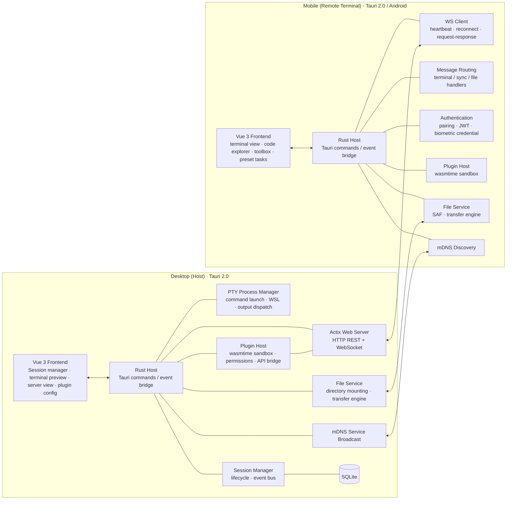

<div align="center">


# BedCode

**Control your desktop Agent CLI from your phone — from bed**

[](https://github.com/7ZAI/BedCode)
[](LICENSE)
[](https://v2.tauri.app/)
[](https://github.com/7ZAI/BedCode)

English | [简体中文](README.md)

</div>

BedCode is a LAN remote terminal application: the desktop app acts as the host running terminal sessions (Agent CLIs like Claude Code, opencode), while your phone becomes a remote terminal with an optimized touch interface — take over your terminal from anywhere on the same WiFi. Any command-line program (including TUI apps) can be started on the desktop and operated remotely from your phone.

> Use cases: as the name suggests — coding from bed; or handling programming tasks in parallel with chores, childcare, or sleep at home.

> [!NOTE]
> Currently supports desktop and mobile on the same WiFi network. An internet connectivity interface / NAT traversal protocol (requires a server) is planned for the future.

## Features

### Desktop (Host)

- **Session Management** — multiple Agent CLI / terminal sessions with SQLite persistence and real-time xterm.js output preview
- **Device Pairing** — QR code + 6-digit code secure pairing, mDNS service advertisement for automatic mobile discovery
- **HTTP + WebSocket Server** — Actix Web with advanced network configuration (worker threads, Keep-Alive, timeouts, frame size limits, etc.), dedicated server management view and metrics dashboard
- **Plugin System** — WASM (wasmtime sandbox), host API bridge, permission control, hooks integration
- **WSL2 Support** — run sessions inside Windows Subsystem for Linux with distro selection
- **System Tray** — quick actions

### Mobile (Remote)

- **Device Discovery & Pairing** — mDNS-based discovery, QR code scanning, or pairing code input
- **Terminal Output** — enhanced mode (parsed ANSI / Markdown) and raw mode toggle
- **Smart Input Bar** — special keys (Tab, Ctrl+C, Esc, arrows), input assistant, shortcut config
- **Code Explorer** — browse project files with syntax highlighting and Git diff rendering
- **Preset Tasks** — task cards with type badges, edit dialog, one-tap execution
- **Toolbox** — quick action panel with customizable commands
- **Task Notifications** — per-session task status notifications, foreground service with screen WakeLock (Android)
- **Auto-Reconnect** — automatic reconnection on unexpected disconnects, edge-to-edge fullscreen display

### Security

- **Pairing** — 6-digit pairing codes (60s expiry), one-time QR tokens (configurable TTL)
- **Biometric Authentication** — mobile biometric credentials bound to a public key, challenge-response signature verification issues session credentials (replay-resistant)
- **JWT Session Auth** (HS256, 7-day expiry) + device fingerprint verification; plugin token for Agent CLI hooks authentication

> [!WARNING]
> The end-to-end encryption toolkit (X25519 ECDH + AES-256-GCM) is implemented, but WebSocket / file transfer integration is still in progress — terminal communication is currently plaintext (`ws://`). Use only on trusted LANs.

### Internationalization

Full vue-i18n support (zh-CN / en) with persistent language switcher in settings; error code mapping system for localized error messages.

## Architecture

Monorepo with two independent projects, each containing `src/` (frontend) + `src-tauri/` (Rust backend):



| End         | Frontend (Vue 3)                                                      | Backend (Rust)                                                                         |
| ---------- | -------------------------------------------------------------------- | ------------------------------------------------------------------------------------- |
| **Desktop** | Session manager, terminal preview, server view, plugin config         | PTY, Actix Web (HTTP + WS), session management, WASM plugin system, mDNS advertisement |
| **Mobile**  | Terminal view, code explorer, preset tasks, toolbox, device discovery | WS/HTTP client, remote connection & routing, file service, mDNS discovery              |

Communication: **WebSocket** (bidirectional terminal stream) + **HTTP REST API** (plugin hooks, file service).

## Tech Stack

| Category      | Technology                                                                                                   |
| ------------ | ----------------------------------------------------------------------------------------------------------- |
| Framework     | Tauri 2.0 (Windows desktop / Android mobile)                                                                 |
| Frontend      | Vue 3 + TypeScript + Vite                                                                                    |
| Styling       | TailwindCSS, state management with Pinia + vue-router                                                        |
| Backend       | Rust (Tokio async runtime), Actix Web 4 + tokio-tungstenite                                                  |
| Database      | SQLite (rusqlite)                                                                                            |
| Terminal      | @xterm/xterm + addon-fit / web-links / webgl                                                                 |
| Auth          | JWT (jsonwebtoken HS256), ECDSA biometric credentials (p256), device fingerprint                             |
| Crypto        | X25519 ECDH + AES-256-GCM (HKDF), ChaCha20-Poly1305, RSA-OAEP/PSS                                            |
| Discovery     | mDNS (mdns-sd)                                                                                               |
| Plugin System | wasmtime (WASM component runtime)                                                                            |
| Other         | shiki (syntax highlighting), ECharts (metrics dashboard), qrcode / html5-qrcode, vue-i18n@9, tracing logging |

## Supported Platforms

| Platform      | Desktop | Mobile  |
| ------------ | :-----: | :-----: |
| Windows       |    ✔    |    —    |
| Android       |    —    |    ✔    |
| macOS / Linux | Planned |    —    |
| iOS           |    —    | Planned |

Currently focused on **Windows (Desktop) + Android (Mobile)**, with both ends' core capabilities (terminal sessions, file service, plugin system) fully working. Cross-platform adaptation is a large effort (system permission models, packaging & distribution, platform integration), so it is not covered yet due to limited bandwidth.

> Built on Tauri 2.0 (Rust backend + Web frontend), cross-platform possibility and convenience are naturally preserved: core business logic and UI are cross-platform technologies. Extending to macOS / Linux / iOS later requires no rewrite of business code — the main work is a platform adaptation layer (packaging, permissions, system API integration).

## Quick Start

### Prerequisites

- [Node.js](https://nodejs.org/) >= 18, [Rust](https://www.rust-lang.org/tools/install) >= 1.94 (wasmtime 47 MSRV)
- [Tauri 2.0 CLI](https://v2.tauri.app/start/prerequisites/) and platform dependencies
- An Agent CLI installed and configured (e.g. [Claude Code](https://claude.ai/code))

### Install & Run

```bash
# Install dependencies
cd bedcode-desktop && npm install
cd bedcode-mobile && npm install

# Development
cd bedcode-desktop && npm run tauri:dev         # Desktop
cd bedcode-mobile && npm run tauri:android:dev  # Mobile (Android logs: tauri:android:dev:log)

# Build
cd bedcode-desktop && npm run tauri:build
cd bedcode-mobile && npm run tauri:android:build

# Testing
cd bedcode-desktop && npm run test:run          # Frontend (vitest run)
cd bedcode-desktop/src-tauri && cargo test      # Rust
```

## Plugin System

Desktop plugins are built on the **wasmtime runtime (WASM Component Model)**: plugins are compiled to WASM components (from Rust / TypeScript) and loaded sandboxed inside the host. Plugins can observe and extend host session behavior:

- **WASM Sandbox Runtime** — resource-constrained, memory-isolated; a plugin crash never affects the host
- **Dynamic Loading** — scanned from `plugins/desktop/{plugin-id}/plugin.json` at runtime, no host recompilation needed
- **Host API Bridge** — versioned API for host functionality (send input, read output, session info) with unified permission checks
- **Permission Control** — plugins declare required permissions; the host enforces access boundaries
- **Hooks Integration** — project-scoped hooks auto-configured on session start, pushing task status (idle / in_progress / asking / completed / interrupted) via HTTP API
- **Session ID Binding** — PTY injects `BEDCODE_SESSION_ID` to bind Agent CLI sessions with BedCode sessions

```
Agent CLI Hook (Python)
    ↓ HTTP POST
Rust HTTP API (plugin_controller)
    ↓ DesktopSyncEvent
SyncEventHandler → WebSocket broadcast
    ↓ ws_sync_task_status_changed
Mobile Tauri Event → Preset Tasks / UI
    ↓ sendInput / HTTP API
Agent CLI (PTY)
```

### Official Plugins

| Plugin            | Version     | Description                                                                                                                                                                                               |
| ---------------- | ---------- | -------------------------------------------------------------------------------------------------------------------------------------------------------------------------------------------------------- |
| **AI Chatbox**    | 1.0.0-beta  | LLM chat: connect to any OpenAI-compatible provider (OpenAI / Anthropic / DeepSeek / Qwen), streaming chat, multi-conversation management, JSONL chat logs persisted to disk                              |
| **Auto Task**     | 1.0.0-beta  | Agent task queue & auto-approval: sync task status from Claude Code / pi / opencode / Codex, task queue scheduling, preset & scheduled tasks, history statistics; auto-approves agent permission requests |
| **File Transfer** | 1.0.0-beta  | LAN file transfer: online peer discovery & switching, remote directory browsing, concurrent transfers (pause / resume / resumable / retry), local directory mounting for peers                            |

### Plugin Development SDK

- **`@binblink/plugin-sdk-desktop`** / **`@binblink/plugin-sdk-mobile`** (npm, MIT) — subpath exports: main API, Vite plugin (`./vite`), shared UI components (`./ui`), type definitions (`./types`)
- **Scaffolding CLI** — `bedcode-plugin-desktop` (mobile: `bedcode-plugin`): `create` scaffolds a plugin project, `dev` browser HMR dev environment, `build`, `manifest` auto-fills declarations, `validate`, `doctor` environment self-check
- **Docs** — `bedcode-desktop/plugin-dev-desktop.md` (desktop) and `bedcode-mobile/plugin-dev-mobile.md` (mobile)

### Future Outlook

- **Hot-pluggable local tools** — the plugin mechanism already supports runtime load, enable, disable and uninstall: wrap common local tools (terminal enhancements, code analysis, file processing, quick commands, etc.) as plugins that can be installed on demand and used instantly, with no host recompilation
- **WASI evolution dividends** — plugins run on top of the WASM Component Model + wasmtime sandbox. As WASI (WebAssembly System Interface) standardization progresses (filesystem, networking, clocks, processes, etc.), plugins gain near-native system capabilities inside a secure sandbox while staying portable across hosts — the same plugin can run on any WASI-compatible environment
- **A personal prediction** — as AI advances, everyone will be able to build their own local apps for their own domain: describe needs in natural language, have cloud vibe coding generate the plugin, cloud build compile it, cloud compute host it, then plug it into the host and use it instantly. This "host + plugin" architecture frees tool-making from the hands of a few developers — everyone can face their own needs directly, and tools are born for the individual

## Contributing

Contributions are welcome! Please feel free to submit a Pull Request.

1. Fork the repository
2. Create your feature branch (`git checkout -b feat/my-feature`)
3. Commit your changes (`git commit -m 'feat: ...'`)
4. Push to the branch and open a Pull Request

## License

MIT - see the [LICENSE](LICENSE) file for details.
